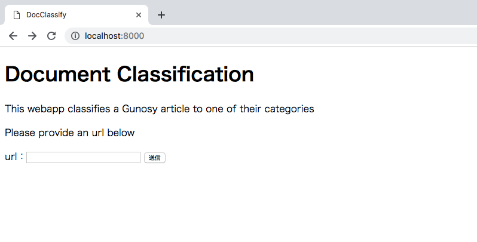
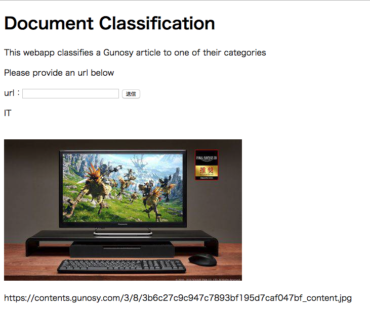

[](https://travis-ci.com/watakandhi/gunosy_coding_task)

# To get the image



# Steps to launch the site
```
docker build .
```

**If django project is not built**
Skip this part if the project is already built and you just want to play around with it.
```
docker-compose build 
docker-compose run webapp sh -c "django-admin.py startproject doc_classsify ."
docker-compose run webapp python manage.py migrate
```


# 課題
- Step1: 記事URLを入れると記事カテゴリを返す、ナイーブベイズを使った教師あり文書分類器ウェブアプリの実装 on docker
- Step2: 文書分類性能の改善

# 具体的な要件
## 実行環境
- docker
- プロジェクトルートに必ずDockerfileを設置する。
    - docker buildにより以下の機能を持つコマンドが実装されたdockerコンテナがビルドされるように記述する。
        - データの収集
        - モデルのトレーニング
        - ウェブアプリの起動
    - 必ず評価者がdocker buildコマンド以外に別途環境設定をすることなく、コマンドを実行できるように定義する。
    - それぞれのコマンド実行方法をプロジェクトルートのREADMEに明記してください

## アプリケーション要件
- Python 3.6
- Django 1.11
- その他ライブラリは自由に使用可能
- ナイーブベイズを使った教師あり文書分類器は、scikit-learnやgensimなどの機械学習ライブラリを使用せず、独自実装してください。
    - NumpyやScipy、TensorFlowなどの数値計算ライブラリの使用は可能です。
- 分類性能を改善する際には、機械学習ライブラリを使用しても構いません。

## Step1: ウェブアプリの具体的な処理について
### ウェブアプリの機能

1. フォームから記事URLを入力する。
2. 1で入力された記事URLのHTMLを取得し、それを元に、記事カテゴリを判定する。
3. 2で判定したカテゴリを画面に出力する。

### ナイーブベイズを使った分類器の作成
- 2で使用する教師あり文書分類器は、事前に学習しておく必要があります。教師データは、 https://gunosy.com/ の「エンタメ」、「スポーツ」、「おもしろ」、「国内」、「海外」、「コラム」、「IT・科学」、「グルメ」の記事を使用して下さい。
- 教師データの収集の際には、サイトに必要以上の負荷をかけないように、リクエストの際に適宜sleepを挟んでください。1秒が望ましいです。
- 学習の際は毎回データを収集するのではなく、収集した教師データをデータベースに保存して利用して学習に利用してください
- 教師データの収集、分類器の学習はDjangoのカスタムコマンドとして実行できるようにしてください
- 分類器は何らかの評価指標を用いて、評価をして下さい。

## Step2: 分類器の精度向上
- どんな方法でもいいので、なんらかの工夫をして精度を向上させる
- ナイーブベイズでなくて、異なる手法を用いても良い。
- その際に機械学習ライブラリを用いてもよい
- Step1で作成した分類器と精度の比較ができるようにしておく

## コード規約
- PEP8に従っていること
    - travis-ciなどを用いて自動でPEP8のチェックを行えるようにしてください
- docstringが書かれていること
- 変数名、関数名が明確であること
- マジックナンバーが使われていないこと
    - 定数はenumを使って分離することを推奨します
- 使ったライブラリはrequirements.txtとして記載してください
    - setup.pyでも可
- 不要なファイルは.gitignoreにかかれており、コミットされていない
- READMEが書かれている
    - 環境構築の方法
    - 動作させるための方法
    - 作った分類器の精度

# 成果物
- ソースコード（GitHubに上げる）
- GitHubはプライベートレポジトリで作成する
    - privateリポジトリの利用、及びprivateリポジトリに対するtravis-ciの利用はgithub　student packに登録すれば無料です
    - こちらを参照してください: https://education.github.com/pack
- 精度向上のために、行った工夫と実際の精度についてREADMEに記載してください

# 期間
★★1ヶ月間（2019年3月15日(金)23:59迄）を目処★★ 

# 評価基準
- Git、Githubの基本的な使い方を理解している。
- Pythonの基本的な実装ができる。
- Webアプリケーションフレームワークの仕組みを理解している。
- 教師あり文書分類器の仕組みを理解している。
- 教師データとテストデータを分離して、精度を検証しなければならないことを理解している。
- 精度向上のために、試行錯誤ができている

